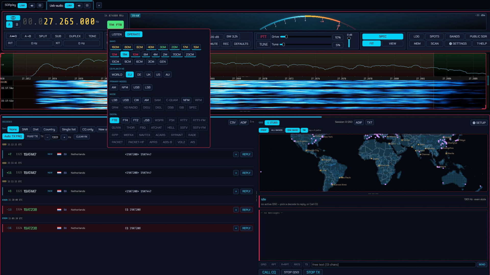
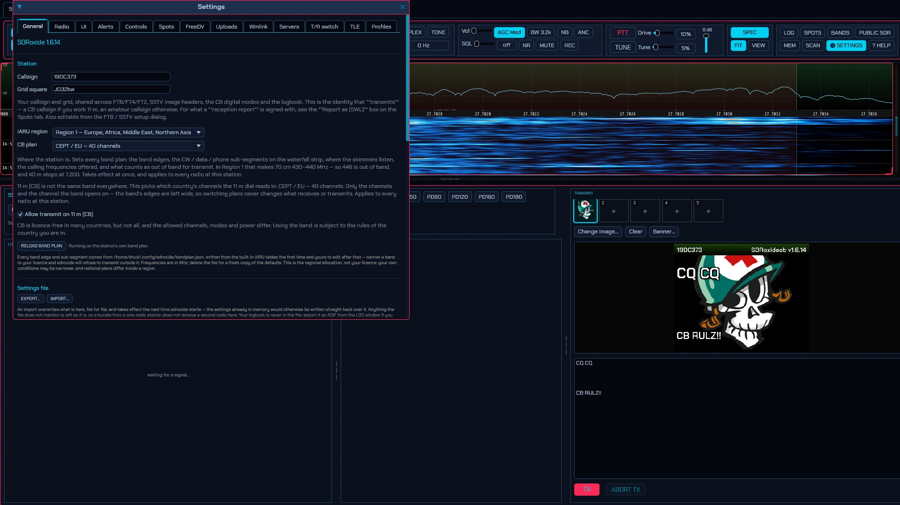
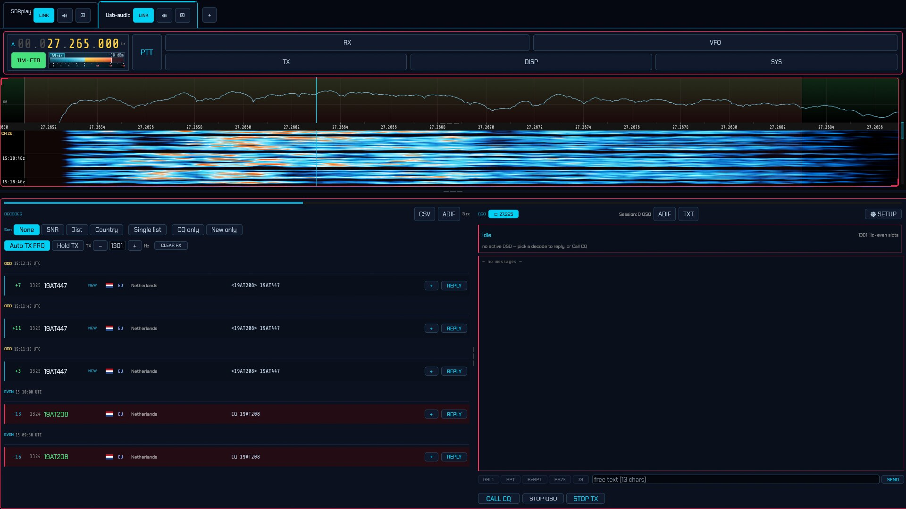

# SDR Oxide — the CB & shortwave-listening fork

> **Windows download** — [**installer (`.msi`)**](https://github.com/madmedicnl/sdroxide/releases/latest/download/sdroxide-windows-x86_64.msi)
> · [**portable `.zip`** (contains `sdroxide.exe`)](https://github.com/madmedicnl/sdroxide/releases/latest/download/sdroxide-windows-x86_64.zip)
> · [every platform and build](https://github.com/madmedicnl/sdroxide/releases/latest)
>
> Linux (AppImage · `.deb` · tarball) and macOS (`.dmg`) are on the same
> [Releases page](https://github.com/madmedicnl/sdroxide/releases/latest).

> **This is a fork of [sdroxide](https://github.com/dividebysandwich/sdroxide), and it is a complete copy of it.**
> Every amateur ("ham") radio feature is here — the whole transceiver, all the
> digital modes, the logbook, awards, rig control. What the fork changes is its
> **focus**: it is tuned for two audiences the original does not serve, the
> **11 m citizens' band (CB)** and the **shortwave listener (SWL)**. Use it as a
> ham radio and you have upstream plus a few conveniences; point it at CB or at
> a listening dongle and that is what it is for. All credit for the original
> belongs to upstream — when something is not CB/SWL-specific it is upstream's
> work and is best read there.

sdroxide is a PowerSDR/Thetis-style software-defined-radio client in Rust, with
pluggable radio backends, an [egui](https://github.com/emilk/egui) GUI and a
cyberpunk theme. It runs as a **native desktop application** and, from the same
binary, as a **server that streams the same UI to a web browser** over
WebSocket. It includes a persistent logbook, many digital modes built in, and
**TCI and Hamlib rigctld servers** so third-party programs like WSJT-X can use
it as their radio.

## Read the manual first

This README is a quick orientation, not the documentation. **The
[User Manual](docs/USER_MANUAL.md) is the real guide** — every window, every
option, every backend and permission detail. It is the fastest way to find out
what this program can actually do; dip into the parts you need and ignore the
rest.

- **[User Manual](docs/USER_MANUAL.md)** — the complete guide.
- **[CB quick-start](docs/cb-quickstart.en.md)** ([Nederlands](docs/cb-quickstart.nl.md) · [Français](docs/cb-quickstart.fr.md) · [Italiano](docs/cb-quickstart.it.md)).
- **[QO-100 Quick-start Guide](docs/qo100-quickstart.en.md)** ([Türkçe](docs/qo100-quickstart.tr.md)).
- **[ROADMAP.md](ROADMAP.md)** — where the listener work goes next.

## Quick start

1. **Get it.** Download for your platform from the
   [Releases page](https://github.com/madmedicnl/sdroxide/releases/latest)
   (Linux AppImage / `.deb` / tarball, Windows `.msi` / `.zip`, macOS `.dmg`),
   or [build it yourself](#building).
2. **Point it at a radio.** Plug in an SDR, or use a network radio
   (SpyServer, KiwiSDR, an OpenHPSDR, a CAT rig, …). `sdroxide --probe` lists
   what it can see and says in words what is missing. Linux USB receivers need
   the packaged udev rules (the `.deb` installs them); Windows USB receivers
   usually need [Zadig](https://zadig.akeo.ie/) to bind WinUSB. See
   [Radio-specific notes](docs/USER_MANUAL.md#15-radio-specific-notes).
3. **Run it.**
   ```sh
   sdroxide                       # native desktop
   sdroxide --server              # UI in a browser at http://<host>:4950
   sdroxide --connect host:4950   # desktop UI driving a remote server
   ```
4. **Tune.** The band/mode menu leads with a **Primary modes** row
   (**AM · FM · USB · LSB**) and lists the broadcast bands (LW / MW / SW / FM)
   and the CB band by name. A band comes up on its own memory of mode, filter
   and frequency, so switching back and forth is one click.
5. **On CB.** Pick the **11 m** band: the channelised dial reads `CH nn`, the
   per-country channel plans are on the General tab, and the WSJT-CB digital
   exchange (with country flags) works like FT8 does. Transmitting on 11 m is a
   deliberate opt-in behind a one-time warning.
6. **Listening (SWL).** Turn on **SWL mode** (Settings → UI, or start with
   `--swl`) and every transmit control disappears. Then: browse the **SCHEDULE**
   window of ~4,600 broadcasts and tune or log a station; watch broadcast
   carriers labelled on the waterfall; keep the separate **SWL log** with
   **SINPO/SIO** and send a **reception report**; replay the last two minutes
   with **REPLAY**; record a band on a timer; or scan 49 m and stop on carriers.
7. **Everything else** — FT8/FT4/FT2, WSPR, PSK/RTTY, Olivia, SSTV, RIFP,
   weather fax, DRM, HD Radio, ADS-B/VDL2/ACARS, the logbook, awards, QSL
   upload, MIDI control — is in the **[User Manual](docs/USER_MANUAL.md)**.

## How this fork differs from upstream

| | Upstream (`dividebysandwich/sdroxide`) | This fork |
| --- | --- | --- |
| **Focus** | amateur (ham) transceiver | **CB and shortwave listening**; transmit stays behind explicit switches |
| **Amateur bands** | 160 m … 3 cm, by IARU region, with band-plan lockout | identical, untouched |
| **11 m / citizens' band** | the band itself (26.965–27.860 MHz) and its digimode conventions | **per-country channel plans** (`WORLD EU DE UK US AU`) with the channels and modes each allows, **CB country flags**, the transmit opt-in behind a one-time warning, and opt-in **spotting to the WSJT-CB spot server** |
| **LOG11DX logbook** | — | uploads each logged QSO straight to the 11 m [LOG11DX](https://log11dx.com/) logbook — no separate bridge program, which its own WSJT-X integration otherwise needs |
| **Broadcast & utility bands** | general coverage only | **LW / MW / SW / FM**, the VHF civil **AIR**band (108–137 MHz, AM) and the **MIL**itary UHF airband (225–400 MHz, AM) on the selector and in the band plan; on shortwave the **metre band** is named ("SW 49m · AM") and offered as a shortcut |
| **Broadcast schedule** | EiBi transmitters labelled on the waterfall | plus a **SCHEDULE** window that filters them by time, band, language and target and tunes or logs a station; utilities (time signals, VOLMET) labelled and stations starred |
| **Listening log** | QSO logbook | a separate **SWL log** — station, frequency, UTC, **SINPO/SIO**, S-meter, notes — with a **reception report** |
| **C-QUAM AM stereo** | — | decoded on MW, with a stereo lamp and a mono blend (not yet verified against a real signal) |
| **MW/SW DX tools** | SAM and the ham audio chain | **ECSS-U / ECSS-L** presets on SAM and a receive **tone** control |
| **Listening tools** | — | two-minute time-shift **replay**, **scheduled recordings**, band scanning that names what it stops on |
| **SWL mode** | — | hides every transmit control and swaps the ham chips (spots, awards) for the listener's; **Start in SWL mode** in Settings → UI, or **`--swl`** |
| **Simple interface** | — | hides the advanced chips |
| **Band/mode menu** | one long list, no band/mode rule | **LISTEN / OPERATE** tabs, a **Primary modes** row above the full list, and modes that do not apply on the current band (AM on the FM broadcast band, WFM on 11 m) greyed out and refused engine-side |
| **CW straight key** | — | the PC keyboard as a straight key (hold **Space**) |
| **Propagation columns** | propagation heat map | measured **WSPR** and **PSK Reporter** activity in the **BANDS** window |
| **Audible alerts** | — | calls, directed CQs and new DXCC/grids ring on their own output |
| **Waterfall levels** | a popup behind a chip | a vertical level slider beside the waterfall, plus the popup |

Upstream has merged most of this fork's general-purpose work since it was
offered, so several rows that used to be differences are not any more and have
been dropped from the table: **HD Radio (NRSC-5)**, **ACARS**, **station
profiles**, the ten editor **themes**, the **USB sound-card** backend, the 11 m
band and its digimode conventions, **EiBi** broadcast labelling, decode
**CSV/ADIF export**, browser **ADIF/CHIRP import** and the step-row **snap** all
live in upstream now. What the table lists is what this fork still adds on top.

The full interface: the radio, receiver, display and system controls along the top, the waterfall with its level slider on the right.



*The band/mode menu — a **Primary modes** row above the full mode and digital lists.*



*Settings → General: station identity, IARU region and band plan, the settings file, the SWR guard and the audio devices.*



*Simple UI: the advanced chips hidden, leaving tuning, mode, volume, squelch, bandwidth, the waterfall, memories and scanning.*

## What it does

- **Radios** — CAT/audio, CAT/stereo I/Q, TCI (SunSDR), OpenHPSDR P1/P2
  (Hermes Lite 2, Apache Labs), SoapySDR, and native drivers for RTL-SDR,
  RX-888, SDRplay RSP, Airspy HF+/R2/Mini, HydraSDR RFOne, HackRF, PlutoSDR,
  LimeSDR + LimeRFE, ELAD FDM, RigExpert Fobos, plus Icom LAN, FlexRadio
  (SmartSDR) and a **USB sound-card** backend. Setup and permissions per model:
  [Radio-specific notes](docs/USER_MANUAL.md#15-radio-specific-notes).
- **Panadapter** — GPU waterfall + spectrum, wheel-zoom on the cursor,
  drag-to-pan, per-digit readout, colormaps, peak-hold and auto-contrast.
- **Modes** — SSB, CW, AM, SAM, **C-QUAM** AM stereo, NFM (CTCSS/DCS),
  WFM (stereo + **RDS/RBDS**), DSB, **ISB**, DIGU/DIGL, SPEC, **DRM**,
  **HD Radio** (FM, stereo), and the receive-only utility decoders **ADS-B**,
  **VDL2**, **ACARS**, **NAVTEX**, **weather fax**.
- **Digital modes** — **FT8/FT4/FT2**, **JS8**, **WSPR**, **PSK31/RTTY**,
  **Olivia/THOR/FSQ**, **Hellschreiber**, **SSTV**, **RIFP**, **RF Paint**,
  **RADE** digital voice, **packet/APRS**, **AtCHAT NET**, **Winlink** email.
  Details and setup are in the [manual's digital-modes chapter](docs/USER_MANUAL.md#3-digital-modes).
- **Receiver** — hang AGC, draggable filter edges, noise blanker, auto-notch,
  four noise-reduction engines, squelch, a sub-receiver, RIT/XIT, VFO A/B with
  split, band stacks and memories.
- **Spots, awards, QSL** — DX cluster / POTA / SOTA / PSK Reporter spots as
  clickable panadapter markers, callsign lookup, one-click upload to
  LoTW/eQSL/Club Log/QRZ/HamQTH, and DXCC/WAS/WAZ/grid tracking. The fork adds
  a **SCHEDULE** window over the broadcast-station labels — filter by time,
  band, language and target, then tune or log a station.
- **Control** — every shortcut rebindable, any class-compliant **MIDI** controller
  (jog wheel, pads, faders, LEDs), mouse-button bindings, and optional **spoken
  announcements** through a bundled local neural voice (plus NVDA/Orca/VoiceOver).
- **T/R switch** — drives an external relay that grounds the antenna while
  transmitting and sequences an amplifier with it; several USB/serial/GPIO
  relay kinds supported. See "T/R switch" in the manual for the limits.
- **Persistence** — device, rates, gains, memories, band stacks, network/QSL
  credentials, control bindings and the logbook under `~/.config/sdroxide/`,
  plus named **station profiles**.

## Installing

Every release carries, for Linux:

- an **AppImage** — one file, no install: download
  `sdroxide-<version>-linux-x86_64-compat.AppImage` (or the `aarch64` one for a
  Raspberry Pi or other ARM board), `chmod +x` it and run it. Built against
  glibc 2.35 and with every native driver compiled in.
- a **`.deb`**, which installs the udev rules and the menu entry for you.
- a **portable tarball**, for anything else.

Windows gets an `.msi` and a portable `.zip`, macOS a `.dmg`. Or build it
yourself.

## Building

**Toolchain.** Install Rust with [rustup](https://rustup.rs/), not your
distribution's `rust`/`cargo`. The workspace is edition 2024 (Rust 1.85+), and
the browser client needs a second target:

```sh
rustup target add wasm32-unknown-unknown
```

The RADE codec, the rtl_433 ISM decoders and the nrsc5/faad2 DRM/HD-Radio
libraries are vendored as git submodules, so clone with:

```sh
git clone --recurse-submodules https://github.com/madmedicnl/sdroxide
# in an existing checkout:
git submodule update --init --recursive
```

**System dependencies.** A native build needs a C toolchain and a few libraries:

```sh
# Debian / Ubuntu
sudo apt install build-essential pkg-config cmake autoconf automake libtool \
                 libclang-dev libasound2-dev libopus-dev
# Arch
sudo pacman -S base-devel pkgconf cmake autoconf automake libtool clang alsa-lib opus
# macOS
brew install pkg-config cmake autoconf automake libtool opus
```

- **ALSA** is not optional on Linux (audio + MIDI). **CMake**, **libclang** and
  **autoconf/automake/libtool** are for RADE, which builds a FARGAN-enabled Opus
  from source — the first build needs network access.
- **libopus** is optional but avoids a CMake 4 problem: if you have CMake ≥ 4 and
  no system Opus, the build stops on `Compatibility with CMake < 3.5 has been
  removed`. Fix it with `sudo apt install libopus-dev pkg-config`, or
  `export CMAKE_POLICY_VERSION_MINIMUM=3.5`.
- **libfdk-aac** is optional and a *runtime* dependency only: it decodes the
  **xHE-AAC** most DRM broadcasters use, and cannot be built in for licence
  reasons. The DRM window says when it is missing.

For the **SoapySDR** backend, install its dev libraries and your radio's driver
module; nothing else (including RTL-SDR) needs an SDR system library, so
`cargo build --release --no-default-features` works with no SoapySDR installed.

**Native binary:**

```sh
cargo build --release
./target/release/sdroxide --probe        # verify your device is seen
```

**Browser client** (separate WebAssembly crate, built with
[Trunk](https://github.com/trunk-rs/trunk) 0.21+):

```sh
cargo install --locked trunk
cd crates/sdroxide-web && trunk build --release      # output in ./dist
```

To bake the client into the binary, build it first, then:

```sh
(cd crates/sdroxide-web && trunk build --release) && cargo build --release --features embed-web
```

Without `embed-web`, `--server` still serves native `--connect` clients; pass
`--web-root crates/sdroxide-web/dist` to serve a Trunk build from disk.

## Running

```sh
sdroxide --freq 14074000 --mode ft8               # native desktop, 20 m FT8
sdroxide --server                                 # server + UI at http://<host>:4950
sdroxide --server --web-root crates/sdroxide-web/dist
sdroxide --connect 192.168.1.10:4950              # native UI driving a remote server
```

**Raspberry Pi 4/5.** Mesa's Vulkan driver (V3DV) makes the display flicker;
sdroxide detects it and renders through OpenGL ES instead, at the cost of about
one core. `WGPU_BACKEND=vulkan sdroxide` takes Vulkan back where it is steady.

## Startup parameters

| Flag | Description |
| --- | --- |
| `--device <ARGS>` | SoapySDR device args (e.g. `driver=hackrf`). |
| `--probe` | List devices and their probed capabilities, then exit. |
| `--console` | Terminal (ASCII) waterfall mode, no GUI. |
| `--siggen` | Use the built-in signal generator instead of hardware. |
| `--file <FILE>` | Play a raw interleaved CF32 IQ file instead of hardware. |
| `--freq <HZ>` | Center frequency in Hz (default: last session; `14200000` on a first run). |
| `--rate <HZ>` | Sample rate in Hz. |
| `--gain <DB>` | Overall RX gain in dB. |
| `--mode <MODE>` | Initial mode by name — `USB`, `LSB`, `CW`, `AM`, `SAM`, `C-QUAM`, `NFM`, `WFM`, `DRM`, `HD RADIO`, `FT8`, `RADE`, … (case-insensitive; default: last session). |
| `--antenna <NAME>` / `--tx-antenna <NAME>` | RX / TX antenna port (see `--probe`). |
| `--server` | Run as a server: HTTP web client + WebSocket backend. |
| `--connect <HOST[:PORT]>` | Connect as a native remote client. |
| `--port <PORT>` | Server port (default `4950`). |
| `--web-root <DIR>` | Directory with the Trunk-built web client. |
| `--fft <N>` | Spectrum FFT size (default `4096`). |
| `--swl` | Start in SWL mode. |
| `--oob-tx` | Lift the amateur-band transmit lockout for this run (licensed out-of-band use; not persisted). |
| smoke tests | `--tx-tune <SECS>`, `--ft8-cq <SECS>`, `--rade-rx <SECS>` |

## Keyboard and mouse

Defaults — all of them, plus PTT, band, mode, filter and more, are rebindable on
the **Controls** tab. The full reference is in the
[manual](docs/USER_MANUAL.md).

| Key | Action |
| --- | --- |
| `←` / `→` | Tune ∓/± 100 Hz (hold **Shift** for 10 Hz) |
| `↑` / `↓` | Tune ± 1 kHz |
| `PageUp` / `PageDown` | Tune ± 10 kHz |
| `M` / `N` / `F` | Mute / noise blanker / fit the panadapter |

On the panadapter: left-click tunes the active VFO, **Shift**+click places the
second receiver, left-drag pans and tunes, right-drag pans only, the wheel zooms
around the cursor, and dragging a passband edge or the frequency-scale strip
resizes the filter or the split.

## Contributing, LLM usage, licensing

Both local and hosted LLMs were used in the development of this software.
Contributions written with LLMs are welcome under the upstream project's rules:
**read and review** what you submit and be able to explain it; **comment** the
non-trivial parts; **test** on real radio hardware where possible, and disclose
when you could not; don't use an LLM for trivial edits; use a modern model with
enough context; keep commits vendor-neutral. This is a **GPLv3** project, and
changing the licence would violate the terms of several bundled libraries.

One part goes further than GPLv3: CW decoding uses the
[DeepCW](https://github.com/e04/deepcw-engine) model, which is **AGPL-3.0-only**
and is linked into the binary rather than read as data, so its terms cover the
built program as a whole. The practical difference is AGPL section 13: **running
`sdroxide --server` and letting other people use it over a network counts as
conveying, so they must be offered the Corresponding Source.** Running it for
yourself changes nothing.

## Acknowledgements

The 11 m band interoperates with, and follows the framing, callsign conventions
and CB country numbering of,
[WSJT-CB](https://github.com/vash909/WSJT-CB) — thanks to its developers — and
the amateur-side FT8/FT4/FT2 it builds on comes from the WSJT-X project. The
original program is [sdroxide](https://github.com/dividebysandwich/sdroxide) by
dividebysandwich; this fork is upstream's work plus the CB and listener
additions. All of it stands on your work.

A special shout-out to the **[Dutch CB Group](https://www.dutchcbgroup.nl/)** and
**[LOG11DX.net](https://log11dx.com/)** — two of the best CB communities there
are, and the reason the 11 m side of this fork exists at all. Thanks for the
channels, the logs and the company.

